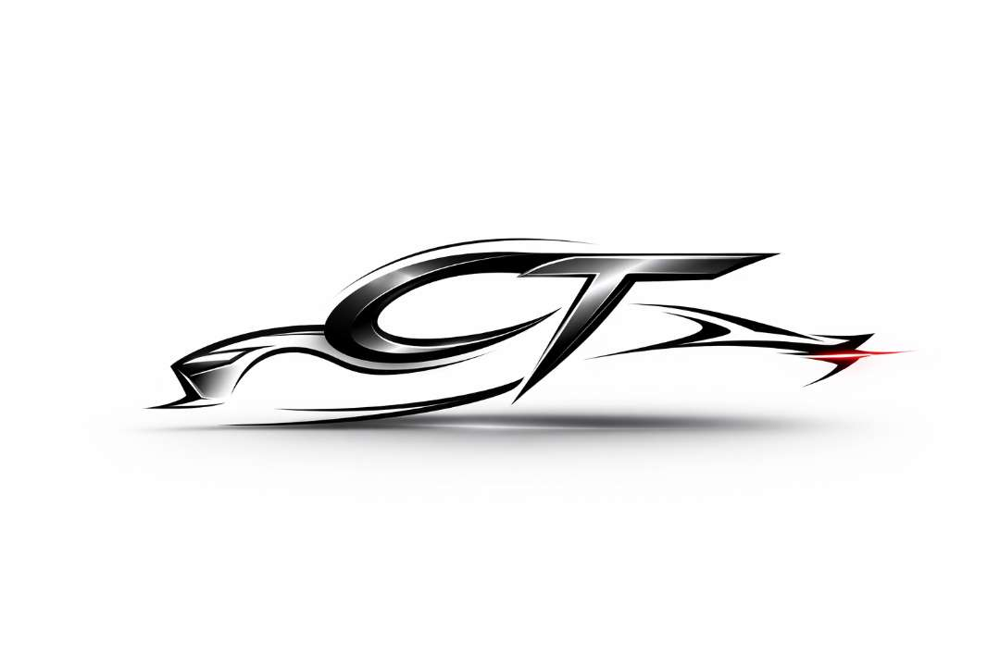

 

  
  
  <h1 align="center">CityTrail</h1>
  

    <strong>Premium Intercity Rides & Cab Booking Service</strong>
     
     
    <a href="https://citytrail.site/">View Website</a>
    ·
    <a href="https://eaglebyte.in/">EagleByte</a>
  

 

## 🌟 About CityTrail

**CityTrail** is a modern, premium intercity cab booking platform designed to provide passengers with a seamless, highly reliable, and aesthetically pleasing ride-booking experience. From quick fare estimation algorithms to a fully interactive user and admin dashboard, CityTrail operates flawlessly across India's largest cities.

### How It Helps the User:
- **Instant Quotations:** No more guessing prices. Users enter their pickup, drop-off, distance, and car type (Sedan, SUV, Innova) to receive an exact price before they ever commit.
- **Secure OTP Rides:** Every booking comes with standard security. When an admin confirms a ride, the user receives a secure One-Time Password (OTP) required to start the trip.
- **Crystal Clear Statuses:** Users can log in to their sleek aesthetic dashboard and watch their ride transition from *Pending* to *Payment Verified* to *Confirmed* in real-time.
- **Premium User Experience:** Built with a Luxury Light Platinum theme, CityTrail provides visually stunning glassmorphism layouts, clean micro-animations, and responsive designs that look incredible on mobile or desktop.

---

## 🚀 Key Features

### For Passengers (Users)
* **Smart Fare Calculator:** Instantly get the price for One Way, Two Way, or Local round trips.
* **Auto-City Suggestions:** Type ahead suggestions for all major Indian cities making form-filling effortless.
* **Beautiful Dashboard View:** Manage profile details, view active upcoming rides, and check the history of past trips cleanly separated into tabs.
* **Personalized Status Updates:** See exactly where your booking stands without calling support.

### For Operations (Admins & Sub-Admins)
* **Master Control Panel:** Super Admins can securely create and manage Sub-Admin accounts directly from the UI.
* **Booking Pipeline:** See exactly who booked a car, verify payments, and fire off OTP codes via email logic securely. 
* **Dynamic Ride Status Control:** Instantly update rides (e.g., mark as Completed, Cancel, etc.) completely taking the burden off automated scripts. 

---

## 💻 Tech Stack

- **Frontend:** React.js, Vite, Axios, Lucide React (Icons), Vanilla CSS (Dynamic Styling)
- **Backend:** Node.js, Express.js, JSON Web Tokens (JWT Authentication)
- **Database:** MongoDB Atlas (Mongoose Object Document Mapping)
- **Security:** Bcrypt.js password hashing, Role-Based Access Control (User, Sub-Admin, Super-Admin)

---

## ⚙️ How to Run Locally

### 1. Backend Setup
1. CD into the backend `cd backend`
2. Run `npm install`
3. Provide a `.env` file with `MONGODB_URI`, `PORT=5000`, `SUPER_ADMIN_EMAIL`, etc.
4. Run `npm run start`

### 2. Frontend Setup
1. CD into the frontend `cd frontend`
2. Run `npm install`
3. Make sure your `.env` contains: `VITE_API_URL=http://localhost:5000`
4. Run `npm run dev` to start the frontend.

---

## 📜 Copyright & Licensing

**© 2026 CityTrail. All rights reserved.**

Designed, developed, and maintained by **Kartik Parmar** through **[EagleByte Web Services](https://eaglebyte.in/)**. 

Unauthorized copying, distribution, modification, or use of any portion of this software without explicit permission from EagleByte.in is strictly prohibited.
